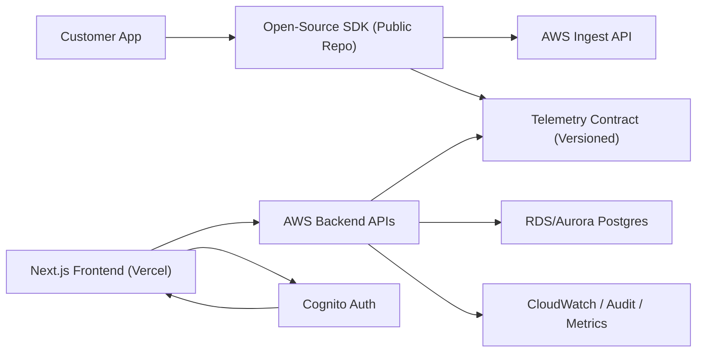

# Design Document: Public SDK + Private SaaS (AWS Backend + Vercel Frontend)

## 1. Architecture Overview
System is split across two repositories and two runtime planes:
- Public SDK repo: Python SDK + telemetry contracts.
- Private SaaS repo: Next.js frontend on Vercel + backend services on AWS.

Key boundary:
- SDK is public and standalone.
- SaaS/backend remains private.

---

## 2. Components

### 2.1 Public SDK Repository
Contains:
- Python instrumentation and local analyzers.
- Telemetry sender and fail-open guarantees.
- Versioned telemetry contract artifact.

Does not contain:
- SaaS implementation details.
- Cloud infrastructure or operational secrets.

### 2.2 Private SaaS Repository
Contains:
- Next.js dashboard/admin frontend.
- AWS backend APIs for ingest/analytics/admin.
- Infrastructure-as-code and operations.

---

## 3. Data And Request Flow
1. SDK captures local telemetry and optionally posts to AWS ingest API.
2. AWS backend validates machine API key and stores telemetry.
3. Frontend (Vercel) calls AWS analytics/admin APIs.
4. Cognito-issued JWT secures user/admin routes.
5. Backend enforces tenant and role policies.

---

## 4. Backend Structure (AWS)
Recommended lean production-ready backend layout:
- API layer: API Gateway.
- Compute layer: Lambda functions (upgrade to ECS/Fargate if needed).
- Data layer: RDS/Aurora Postgres.
- Auth: Cognito user pool and JWT validation.
- Secrets: AWS Secrets Manager.
- Observability: CloudWatch logs/metrics/alarms.

Service modules (in private repo):
- `ingest-service`
- `analytics-service`
- `admin-service`
- `authz-service`

---

## 5. Auth Model

### 5.1 Machine Ingest
- Header: `Authorization: Bearer lok_<prefix>.<secret>`
- Backend:
  - Parse and hash secret.
  - Validate against `api_keys` table.
  - Enforce org/project scoping.

### 5.2 Human Dashboard/Admin
- Frontend login via Cognito.
- Backend validates JWT (signature, expiry, audience).
- Admin actions require explicit admin role claim.

---

## 6. Schema And Contracts
Core tables (private backend DB):
- `organizations`
- `projects`
- `api_keys`
- `audit_logs`
- `telemetry_events`

Contract strategy:
- Shared telemetry schema versioned and consumed by both repos.
- Compatibility tests prevent breaking changes.

---

## 7. Security Considerations
- Public repo contains no SaaS secrets or infra details.
- API keys hashed at rest, never logged in plaintext.
- JWT-based auth for users/admins.
- Strict tenant isolation in all data queries.
- Admin mutations always audit-logged with actor identity.

---

## 8. Deployment Model
- Frontend deploys to Vercel.
- Backend deploys to AWS accounts by environment (dev/stage/prod).
- CI validates contract compatibility across repos before release.

---

## 9. Folder Structure Guidance
Public SDK repo (target):
- `sdk/python/llm_observer`
- `shared/schema/telemetry_event_v1.json`
- SDK docs and tests only

Private SaaS repo (target):
- `apps/web` (Next.js frontend)
- `services/backend/*` or equivalent AWS service layout
- `infra/aws/*` IaC
- SaaS-only docs/runbooks

---

## 10. Risks And Tradeoffs
- Two-repo model increases release coordination overhead.
- Strongly reduces accidental exposure of SaaS IP/secrets.
- Requires strict contract versioning discipline.

---

## 11. Local Development
- SDK: local Python env + SDK tests.
- SaaS frontend: `next dev` on Vercel-compatible settings.
- Backend: AWS-local tooling or deployed dev environment.
- Contract tests run in both repos to validate compatibility.
